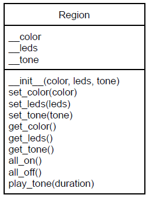
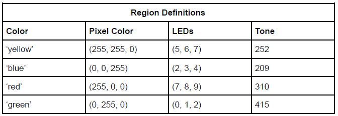

# Classes with CPX Part 2

#### [Go to part 1](README.md)

### Introduction
In this second part of the using classes in the CPX environment we are going to add sound to
the class. Also, to help in the iteration of the regions you are going to store the region object as
a value in a Dictionary. Some of this write-up will be the same as Part 1 to ensure that the
similarities exist between the parts.

### Procedure
- After the import section of your code create a class based on the following UML diagram:

  - The __color attribute should hold the color tuple (Red, Green, Blue)
  - The __leds attribute is expected to hold a tuple of values between 0 and 9
    - example: (0, 2, 4)
  - The __tone is a sound that is associated with the color and LED pattern
  - Method all_on() should turn on all the leds in the __leds tuple.
    - This can be done using a ‘for’ loop which iterates over the values in __led
and set their color to __color
  - Method all_off() should set all the leds in __leds to (0, 0, 0)
  - Method play_tone(duration) plays a tone associated with the region

- After the class declaration and before the process ‘while’ loop, create a dictionary which
contains the color of the region as the key and the object created using the Region class
for four colors (See the screenshot for an example)
- Use the information in the following table to define the colors, leds and tone:

- In the process ‘while’ loop use a ‘for’ loop to iterate over the dictionary and flash each
region and play color’s tone
- See the action as demonstrated in this [video](https://www.youtube.com/shorts/iaT6sW_Lv-8).

### Turn-in
- Push your completed code to this repo
- Upload a short video demonstrating the flashing lights (If remote)

### Evaluation
- Proper use of comments
- Code the class according to specifications
- Make a dictionary of the region settings
- Iterate over the dictionary using a ‘for’ loop
- Video demonstrating working project