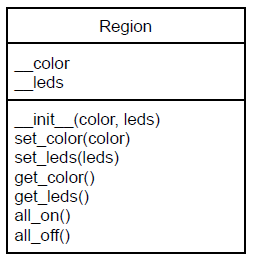

# Classes with CPX Part 1

#### [Go to part 2](Part2.md)

### Introduction
Create a class to light a group of lights of a particular color. This is first part of a continuing
project leveraging the tools we’ve been learning this semester.

### Procedure
- After the import section of your code create a class based on the following UML diagram:

  - The __color attribute should hold the color tuple (Red, Green, Blue)
  - The __leds attribute is expected to hold a tuple of values between 0 and 9
    - Example: (0, 2, 4)
  - Method all_on() should turn on all the leds in the __leds tuple.
    - This can be done using a ‘for’ loop which iterates over the values in __led
and set their color to __color
    - Method all_off() should set all the leds in __leds to (0, 0, 0)
- After the class declaration and before the process ‘while’ loop, create two objects based
on the class similar to this:

- In the process loop use the created objects to flash the regions on and off
- See the action as demonstrated in this [video](https://www.youtube.com/shorts/ZAoK1FpIhsw).

### Turn-in
- Add and commit your files to this repo and push
- Upload a short video demonstrating the flashing lights (if remote)

### Grading
- Proper use of comments
- Code the class according to specifications
- Make two objects based on the class
- Flash the two regions of LEDs
- Video demonstrating working project
